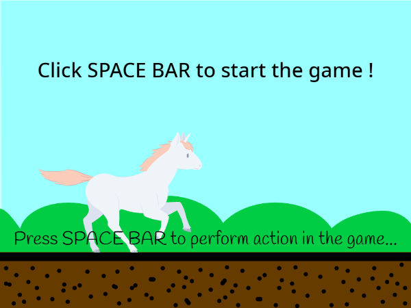
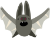
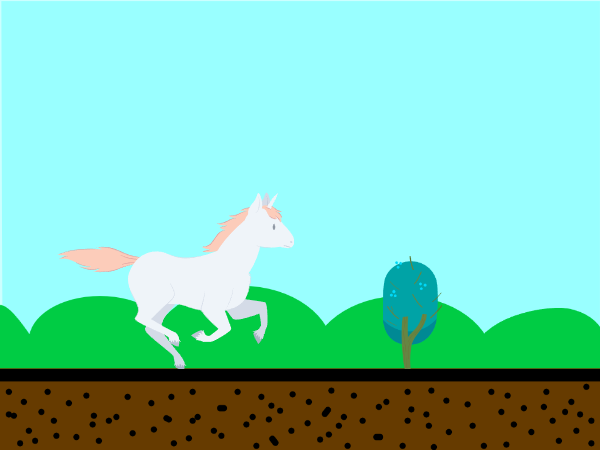
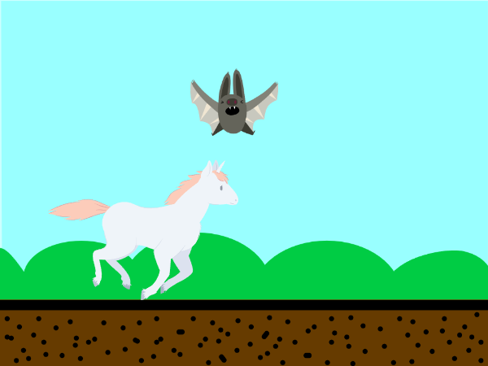
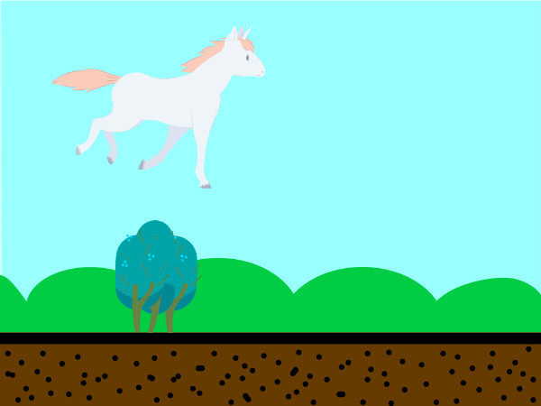
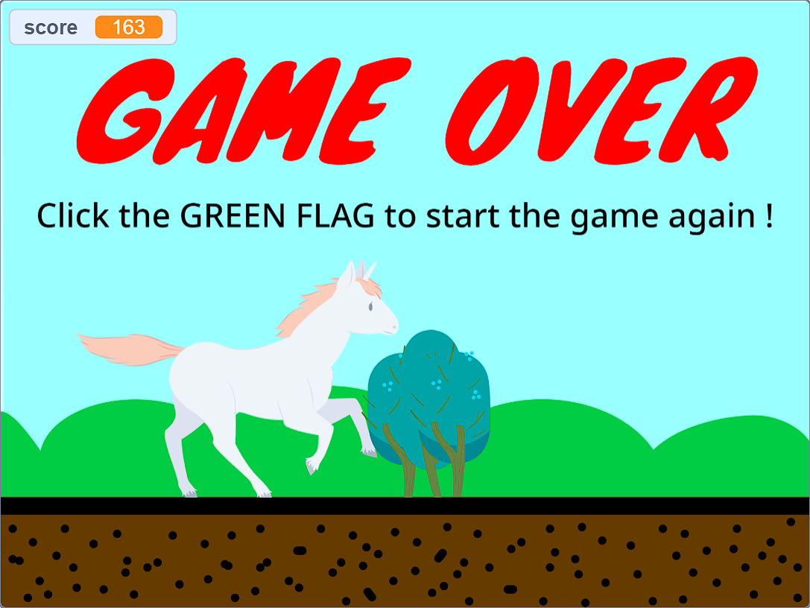

# Unicorn Runner - A Scratch Game

Unicorn Runner is an exciting and whimsical game created using Scratch, inspired by the classic Chrome's Dino Game. In this alternate version, you'll guide a magnificent white unicorn horse through a magical landscape, jumping over trees and escaping bats that serve as hurdles. Get ready for a fun and enchanting adventure!

## Game Overview

Unicorn Runner is a side-scrolling endless runner game where you control a beautiful white unicorn horse. Your objective is to keep the unicorn running as far as possible, avoiding obstacles and collecting points along the way. The game features a delightful fantasy setting with vibrant visuals and engaging gameplay.

## Controls

- **Spacebar**: Jump

## Hurdles

### Trees

The towering trees are one of the main hurdles in the game. Use your jumping skills to leap over them and continue your journey.

### Bats

Bats fly at varying heights across the screen. Make sure to time your jumps right to avoid colliding with them.

## How to Play

1. Start the game by clicking the space button.
2. The unicorn will start running automatically.
3. Use the spacebar to jump over trees and bats.
4. Collect as many points as possible by running farther and jumping over hurdles.
5. The game ends if you collide with any obstacle. Your final score will be displayed in the upper left corner.

## Screenshots

## Credits

- Game created by Qaidjohar Jukker
- Scratch sprites and backgrounds sourced from the Scratch library
- Special thanks to the Scratch community for their support and inspiration

## Disclaimer

Unicorn Runner is a fan-made game and is not affiliated with Chrome's Dino Game or Google in any way. This project is purely for educational and entertainment purposes.

Enjoy playing Unicorn Runner and have a magical time leaping through the fantasy world!

---

Note: To play the game more efficiently and get the best user experience, you will need to have Scratch installed. Simply download the Scratch project file and open it using Scratch to start the game.
      You can also play the game on any browser by just downloading the HTML file of the game on your device and opening it on a browser.
